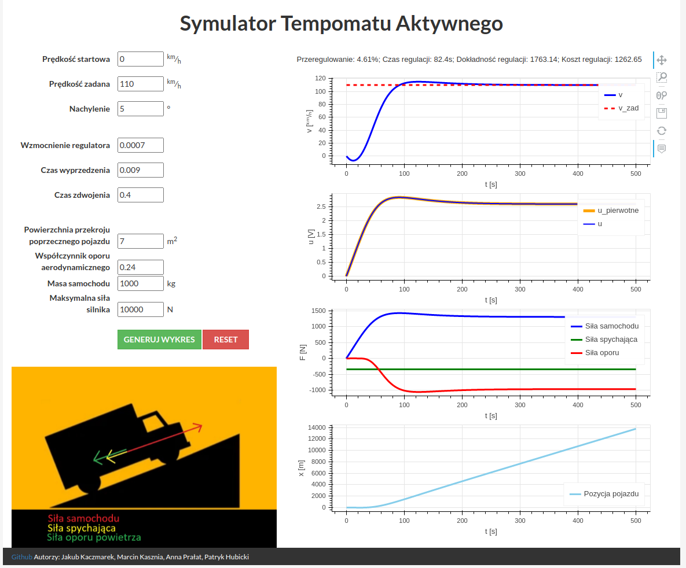

# Symulacja tempomatu aktywnego

Projekt zaliczeniowy na laboratorium z Podstaw Automatyki.

Autorzy: Patryk Hubicki, Jakub Kaczmarek, Marcin Kasznia, Anna Prałat

Informatyka 3 sem, Wydział Informatyki i Telekomunikacji, Politechnika Poznańska 2020/21.

Interaktywna wersja demonstracyjna: https://tempomat-pa-pp.herokuapp.com/

## Uruchomienie

1.  Opcjonalnie: utworzyć _virtual enviroment_
1.  Zainstalować zależności z pliku `requirements.txt`
1.  Uruchomić plik `wsgi.py` z katalogu `app/`
1.  Aplikacja będzie dostępna pod adresem `localhost:5000`

Alternatywnie można wykorzystać przygotowany `makefile` przez polecenie `$ make`

# Cruise control simulation

Final project for laboratory in Basic of automatics.

Authors: Patryk Hubicki, Jakub Kaczmarek, Marcin Kasznia, Anna Prałat

Computing 3 sem, Faculty of Computing and Telecomunications Poznań Univeristy of Technology 2020/2021.

Interactive version avaliable under: https://tempomat-pa-pp.herokuapp.com/

## Running

1. Optionaly: create _virtual enviroment_
2. Install dependencies from `requirements.txt`
3. Run the `wsgi.py` file from `app/` folder
4. App should be avaliable under `http://localhost:5000`

Alternatively use a provided `makefile`, run with `$ make`
